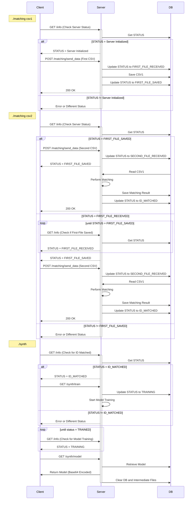

# 概要

Gramine-EIM-Synthの状態を把握するためのステータスについて記載。

# 確認方法
```
$ curl <IP>:8080/info
```
※ http未対応につきhttpsで叩くと想定外挙動になるため注意

# レスポンス形式（変更可能性あり）
以下の形式のjson文字列が返ってくる。（実際は改行なし）
```json
{
    "health": "healthy",
    "server_state": 
    {
        "message": "Server Initialized",
        "status_code": 0
    },
    "version": "v1.0.5"
}
```

# ステータス一覧（変更可能性あり）

| status_code | message | 意味 |
| ---- | ---- | ---- |
| 0 | Server Initialized | 初期状態 |
| 1 | First-File Received | 1つ目のファイルが受理された |
| 2 | First-File Saved | 1つ目のファイルが保存され、2つ目のファイルを受理する準備が整った |
| 3 | Second-File Received | 2つ目のファイルが受理された |
| 4 | ID Matched | 1つ目のファイルと2つ目のファイルのIDマッチングが完了し、学習の準備が整った |
| 5 | Model Training | マッチング済みデータを元に学習が実行中 |
| 6 | Model Trained | マッチング済みデータを元に学習が完了し、学習モデルダウンロードの準備が整った |
| -1 | Status Unknown | 想定外の状態 |

## ステータスの遷移イメージ（変更可能性あり）
Clientが `matching`, `synth` バイナリを実行した時のServerの状態遷移図。  
